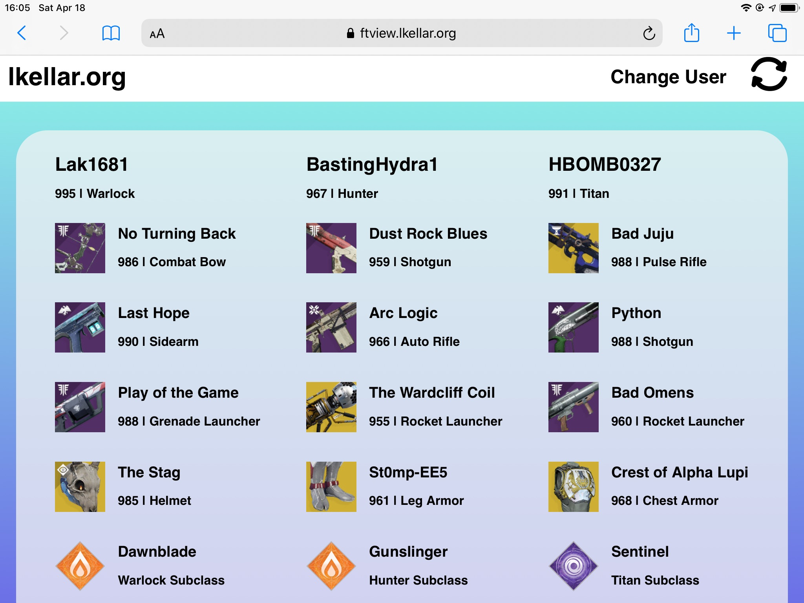

# Destiny Fireteam Item Viewer

## Deprecation Notice
So, it turns out the transition to Bungie Names broke this application. I'm no longer maintaing this application so unfortunately there will not be a fix. On the upside, there are several excellent alternative applications with much more info that are available

Check out the following (all by the same people, just with different content
* [guardian.report](https://guardian.report)
* [crucible.report](https://crucible.report)
* [trials.report](https://trials.report)

Quickly see what the other members of your Destiny 2 Fireteam are using.

Essentially what this app does, it allows a client to input a username for Destiny 2, it finds all members of the fireteam, and then displays the equipment they're using.

The code right now is currently a mess, as I threw this together over a weekend, but I intend to go back, clean it up, and well document it. 

## Installation
You'll need a [Bungie API Key](https://www.bungie.net/en/Application) to make your own build of this app. It needs to be an environment variable with the name `REACT_APP_BUNGIE_API_KEY`. Create-React-App has [some good docs](https://create-react-app.dev/docs/adding-custom-environment-variables/) on how to do that. 

After that, just do `npm start` or `npm run build` to run the development server or create a production build respectively.
